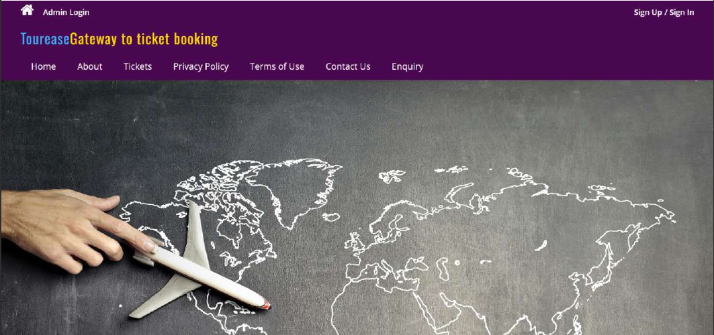
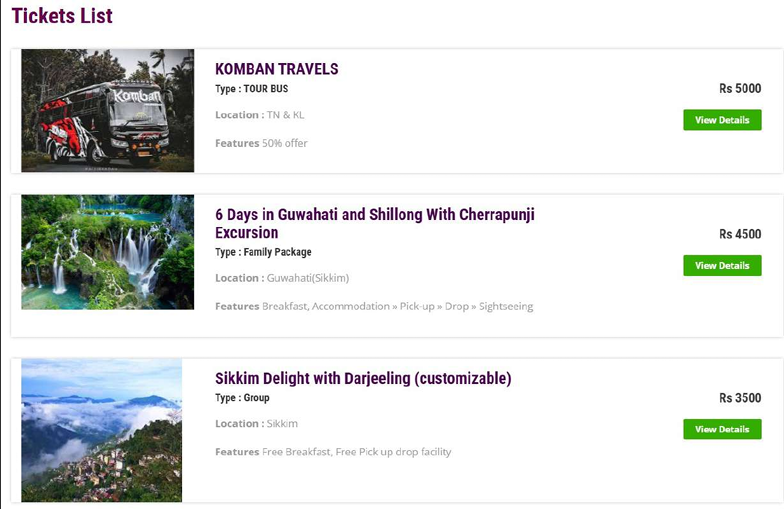
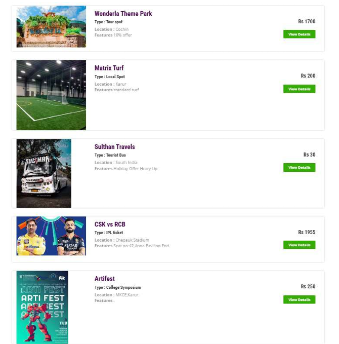
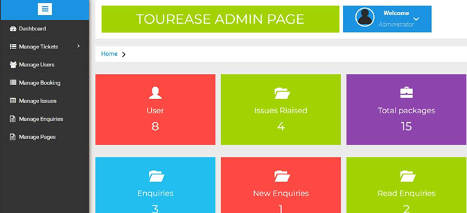

# Tourease - Tourism Management System

**Tourease** is a web-based Tourism Management System developed using PHP, MySQL, and XAMPP. It provides an all-in-one platform for travelers to plan and manage their trips effortlessly. From booking tourist spots and tour packages to reserving tickets for events and sports turfs, Tourease makes travel and leisure planning seamless and efficient.

## 🚀 Features

- 🎟️ Book tickets for various tourist destinations
- 📦 Reserve customizable tour packages (city tours, holiday packages, etc.)
- 🚌 Book tourist buses for sightseeing or intercity travel
- 🎫 Book tickets for local events and entertainment shows
- 🏟️ Reserve sports turfs for games and activities
- 🔄 Real-time availability and pricing
- 🧭 Personalized trip planning based on user interests
- 📊 Admin dashboard for managing bookings, users, and content

## 🛠️ Tech Stack

- **Frontend**: HTML, CSS, JavaScript
- **Backend**: PHP
- **Database**: MySQL
- **Server Environment**: XAMPP


## 💻 Installation & Setup

1. Clone the repository from GitHub using the following command in your terminal or Git Bash:  
```bash
git clone https://github.com/prasanth-42/tourease.git
```
2. Move the downloaded project folder to your XAMPP `htdocs` directory. Example path:  
   `C:/xampp/htdocs/tms`

3. Open the XAMPP Control Panel and start both **Apache** and **MySQL**.

4. Open your browser and navigate to [http://localhost/phpmyadmin](http://localhost/phpmyadmin).

5. Create a new database:
   - Click on **New** in the left sidebar.
   - Name the database `tms` and click **Create**.

6. Import the project database:
   - Select the newly created `tms` database.
   - Click the **Import** tab.
   - Click **Choose File** and upload the `tms.sql` file from your project folder.
   - Click **Go** to complete the import.

7. Run the project in your browser by navigating to:  
   `http://localhost/tms`

   
## 📸 Screenshots

### 🏠 Home Page


### 🎟️ Ticket List - View 1


### 🎟️ Ticket List - View 2


### 🛠️ Admin Dashboard


## 🎥 Project Demo

Watch the full video explanation here:  
[▶️ Tourease - Project Demo](https://youtu.be/bT3mZ9UrGpM)

## 📬 Contact

For any queries or feedback, feel free to reach out via [email](mailto:prasanth6044@gmail.com).

## 📄 License

This project is licensed under the MIT License.  
See the [LICENSE](LICENSE) file for more details.
